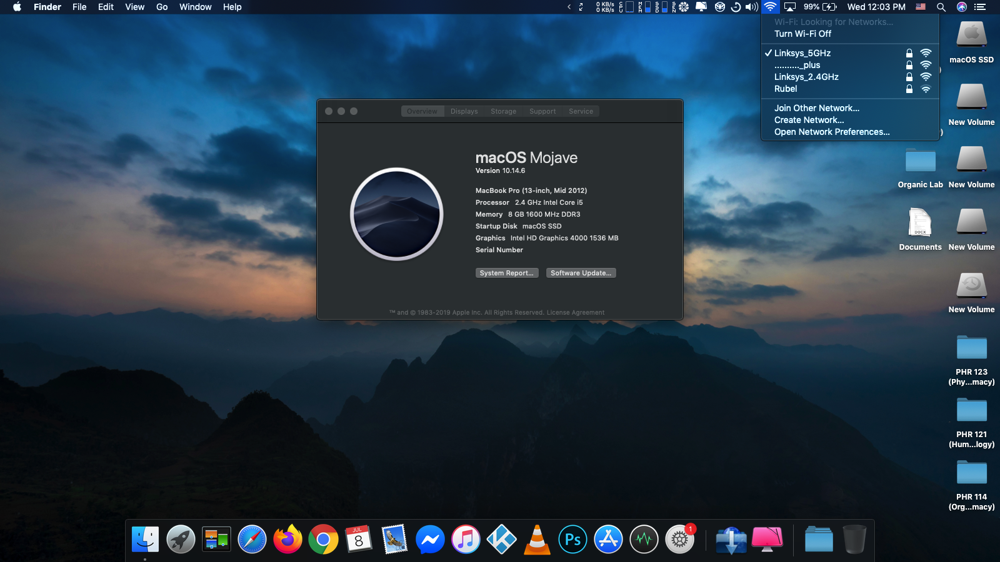
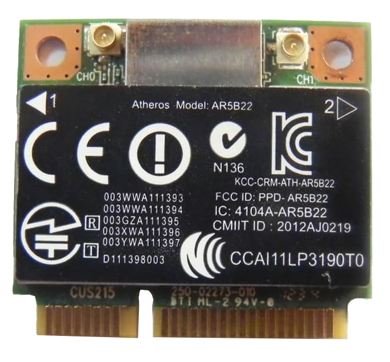

# Hackintosh EliteBook Folio 9470m
<p align="justify" > 
If you are a windows user and require macOS to learn XCode, then you can transform your windows machine into the Hackintosh machine. Remember, this tutorial is for educational purpose. I will be not responsible for any damage done to your device while installing macOS. Do at your own risk. This tutorial is only for Hp EliteBook Folio 9470m, running BIOS version F.73.
<br>There are lots of videos on how to installing macOS on a device. So, instead of installation, I will be guiding you with the correct BIOS setting before installation, and share my EFI files. Back up your important files before starting. Enjoy.!
</p>
<p align="center"></p>

## Make Bootable USB with macOS Mojave, on a Windows 10 machine:
```
  ✰✰✰✰✰✰✰✰✰✰✰✰✰✰✰ You can make a bootable USB from an original Mac machine, or ✰✰✰✰✰✰✰✰✰✰✰✰✰✰✰✰
  ✰✰✰✰✰✰✰✰✰ from a macOS installed into VirtualBox (especially the Windows OS users) ✰✰✰✰✰✰✰✰✰✰
  ```
</img>
- Here I will explain the process of making a bootable USB drive. So be patience:
  - Size of the USB drive can be 8GB or more.
  - Install any macOS operating system(Sierra or later) into a [VirtualBox](https://www.youtube.com/watch?v=qdR3T2jKucE).
  - You can download the macOS_Mojave(18G95).dmg file from [torrentmac.net](https://www.torrentmac.net/macos-mojave-10-14-6-18g95/), then open it through VirtualBox and copy "macOS Mojave Installer" into the "Applications" section of macOS.
  - Use USB 2.0 pen drive, to avoid error like: 🚫  sign with [dark background](https://github.com/md-siam/Hackintosh_EliteBook_Folio_9470m/blob/master/images/USB_Disconnected.jpg)
  - Open "Disk Utility" and format your USB pendrive according to [this](https://github.com/md-siam/Hackintosh_EliteBook_Folio_9470m/blob/master/images/USB_Formatting.png).
  - Turn on "Terminal" and copy & paste the command below:
  - ```sudo /Applications/Install\ macOS\ Mojave.app/Contents/Resources/createinstallmedia --volume /Volumes/MyVolume```
  - "MyVolume" - it is the name of your USB pen drive.
  - After making a USB bootable device, download "Clover Configurator" inside the VirtualBox. Mount the EFI partition, of the USB drive, using clover configurator, and replace the EFI folder with my EFI folder (unzip EFI.7z before placing it inside EFI partition).
  - Done with bootable USB device.


## BIOS Settings:
  ```
  ✰✰✰✰✰✰✰✰✰✰✰✰✰✰✰✰✰ First of all, upgrade your ElitBook BIOS to "68IBD Ver. F.73 ✰✰✰✰✰✰✰✰✰✰✰✰✰✰✰✰✰✰
  ✰✰✰✰✰✰✰✰✰✰✰✰✰✰✰✰✰✰✰ Because this EFI file is only tested in that BIOS version ✰✰✰✰✰✰✰✰✰✰✰✰✰✰✰✰✰✰✰
  ✰✰✰✰✰✰✰✰✰✰✰✰✰✰✰✰ WARNING! BIOS version downgrading is NOT possible in any laptop ✰✰✰✰✰✰✰✰✰✰✰✰✰✰✰✰
  ✰✰✰✰✰✰✰✰✰✰✰✰✰✰✰✰✰ So, if you upgrad to a newer version then you CANNOT downgrade ✰✰✰✰✰✰✰✰✰✰✰✰✰✰✰✰
  ```
  
- Match your BIOS setting with the pictures gives below:
  - Boot Options: [Photo 1](https://github.com/md-siam/Hackintosh_EliteBook_Folio_9470m/blob/master/images/Boot_Options/IMG_1393.JPG), [Photo 2](https://github.com/md-siam/Hackintosh_EliteBook_Folio_9470m/blob/master/images/Boot_Options/IMG_1394.JPG), [Photo 3](https://github.com/md-siam/Hackintosh_EliteBook_Folio_9470m/blob/master/images/Boot_Options/IMG_1395.JPG)
  - Device Configuration: [Photo 1](https://github.com/md-siam/Hackintosh_EliteBook_Folio_9470m/blob/master/images/Device_Configurations/IMG_1396.JPG), [Photo 2](https://github.com/md-siam/Hackintosh_EliteBook_Folio_9470m/blob/master/images/Device_Configurations/IMG_1397.JPG), [Photo 3](https://github.com/md-siam/Hackintosh_EliteBook_Folio_9470m/blob/master/images/Device_Configurations/IMG_1398.JPG), [Photo 4](https://github.com/md-siam/Hackintosh_EliteBook_Folio_9470m/blob/master/images/Device_Configurations/IMG_1399.JPG)
  - Built-In Device Options: No change
  - Port Options: ✓Flash media reader, ✓USB Port, ✓Smart Card
  - AMT Options: [Photo 1](https://github.com/md-siam/Hackintosh_EliteBook_Folio_9470m/blob/master/images/AMT_Options/IMG_1401.JPG)
  - Set Security Level: No change

## Things that do not works:

<p align="justify" >
So far everything is working smoothly, except the <i><b>Bluetooth</b></i>. There are no drivers for the Intel Wifi card. So, I replaced my Intel card with Atheros Qualcomm AR5B22. This card is also available for different brand laptops. For HP laptop, buy the card with a black label on it. A picture of my WiFi card is given on your right.
</p>

## Special Thanks To:
1. [tonymacx86](https://www.tonymacx86.com) for Clover
2. [torrentmac](https://www.torrentmac.net) for full macOS Mojave DMG file [sharing](https://www.geekrar.com/download-macos-mojave-dmg-file-direct-links/)
3. [ComputerTipsLaiju](https://www.youtube.com/watch?v=57aA8e9YQSg&t=66s) for macOS installation guide
